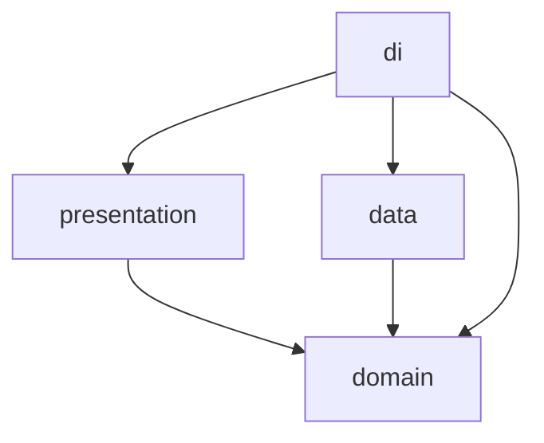

# eudi-wallet-exploration-android


## :mag: Overview

This guide walks through building a very minimal but functional digital identity wallet ecosystem from scratch.
The goal is not about production quality &mdash; it is to give you a genuine hard-won understanding of the credential
issuance and presentation flows.

By the end, you will have built three core concepts:

- **Issuer** &mdash; a Kotlin Spring Boot backend that issues verifiable credentials to a wallet
- **Wallet** &mdash; an Android application that receives, stores, and presents credentials
- **Verifier** &mdash; a Kotlin Spring Boot backend that requests and validates credential presentations

---

## :bulb: Key Concepts

### The Ecosystem

The EUDI Wallet world involves three roles:

| Role         | Responsibility                                                                         |
|--------------|----------------------------------------------------------------------------------------|
| **Issuer**   | Issues credentials to a wallet (e.g. a government issuing a digital ID)                |
| **Wallet**   | Holds credentials and presents them when requested                                     |
| **Verifier** | Requests proof of a credential from a wallet (e.g. an age check at a service provider) |

### OIDC4VCI &mdash; OpenID for Verifiable Credential Issuance

This is the protocol the **Issuer** uses to get a credential into the **Wallet**. The high level flow is:

1. Issuer generates a credential offer (URI or QR code)
2. Wallet receives the offer and fetches issuer metadata
3. Wallet authenticates with the Issuer using a pre-authorised code
4. Wallet requests a credential, proving possession of its key
5. Issuer returns a signed credential
6. Wallet stores it

### OpenID4VP &mdash; OpenID for Verifiable Presentations

This is the protocol the **Verifier** uses to request proof from the **Wallet**. The high-level flow is:

1. Verifier generates an authorisation request (URI or QR code)
2. Wallet receives the requests and identifies matching credentials
3. Wallet shows a consent screen to the user
4. Wallet constructs a Verifiable Presentation &mdash; a signed, selective disclosure of the credential
5. Wallet sends the presentation to the Verifier
6. Verifier validates it and returns a result

### Key Terms

| Term                         | Meaning                                                                                                               |
|------------------------------|-----------------------------------------------------------------------------------------------------------------------|
| VC (Verifiable Credential)   | A tamper-evident credential issued by an Issuer                                                                       |
| VP (Verifiable Presentation) | A VC (or subset of one) wrapped and signed by the Wallet for a specific Verifier                                      |
| SD-JWT                       | Selective Disclosure JWT &mdash; the credential format used in EUDI; allows the holder to reveal only specific claims |
| DID                          | Decentralised Identifier &mdash; a way to identify issuers/wallets without a central authority                        |
| Credential Offer             | A URI the Issuer produces that kicks off the OIDC4VCI flow                                                            |
| Presentation Definition      | A JSON structure the Verifier sends describing what credentials and claims it needs                                   |
| c_nonce                      | A challenge nonce the Issuer sends so the wallet can prove cryptographic key possession                               |
| Pre-Authorised Code          | A one-time code that allows a wallet to skip the full OAuth login and go straight to token exchange                   |

---

## :file_folder: Project Structure

Two separate repositories:

```text
eudi-wallet-exploration-backend     <- Kotlin Spring Boot (Issuer and Verifier)
eudi-wallet-exploration-android     <- Kotlin + Jetpack Compose (Wallet)
```

---

## :hammer_and_wrench: Tech Stack

| Component            | Technology               | Reason                                         |
|----------------------|--------------------------|------------------------------------------------|
| Backend              | Kotlin + Spring Boot     | &mdash;                                        |
| Android              | Kotlin + Jetpack Compose | &mdash;                                        |
| Credential Format    | SD-JWT (simplified)      | Used in EUDI ARF; mdoc is out if scope for now |
| Crypto               | Nimbus JOSE + JWT        | Used in official EUDI Kotlin libraries         |
| Networking (Android) | Ktor Client              | Consistent with EUDI library internals         |

---

## :classical_building: Android Architecture

The wallet follows MVVM with a clean separation between UI, domain, and data layers.

### Dependency Graph



---

## :construction: How to Build

### Project Setup

Create a new Android project in Android Studio with:

- Minimum SDK: API 26 (matches EUDI Wallet Core requirement)
- Language Kotlin
- UI: Jetpack Compose

Add to `build.gradle.kts` (app):

```Gradle
implementation("io.ktor:ktor-client-android:$ktor_version")
implementation("io.ktor:ktor-client-content-negotiation:$ktor_version")
implementation("io.ktor:ktor-serialization-kotlinx-json:$ktor_version")
implementation("com.nimbusds:nimbus-jose-jwt:9.37.3")
```

Create the full package structure described in 
[Android Architecture](#classical_building-android-architecture) and stub out all classes
before implementing.

Run both projects and confirm they build cleanly before proceeding.

> Note: `10.0.2.2` is the Android emulator's alias for `localhost` on your host machine. Use this
> as the base URL when connecting from the Android app to the locally running backend.

---

### The Wallet: Receiving a Credential (OID4VCI)

**Goal:** Implement the Android wallet side of the OID4VCI flow.

#### Deep Link Handling

Register the `openid-credential-offer://` scheme in `AndroidManifest.xml` on your `MainActivity`:

```xml
<intent-filter>
    <action android:name="android.intent.action.VIEW" />
    <category android:name="android.intent.category.DEFAULT" />
    <category android:name="android.intent.category.BROWSABLE" />
    <data android.name="openid-credential-offer" />
</intent-filter>
```

In `WalletNavGraph.kt`, register this deep link on the `receive` destination and pass the incoming
URI to `ReceiveCredentialViewModel`. For testing without a QR scanner, add a button in
`ReceiveCredentialScreen` that fetches the offer URI directly from
`GET http://10.0.2.2:8080/credential-offer`.

#### Implement `IssuerApiService`

```Kotlin
class IssuerApiService {
    private val client = HttpClient(Android) {
        install(ContentNegotiation) { json() }
    }

    suspend fun fetchMetadata(issuerUrl: String): IssuerMetadata =
        client.get("$issuserUrl/.well-known/openid-credential-issuer").body()

    suspend fun requestToken(tokenEndpoint: String, preAuthorisedCode: String): TokenResponse =
        client.post(tokenEndpoint) {
            contentType(ContentType.Application.FormUrlEncoded)
            setBody(FormDataContent(Parameters.build {
                append("grant_type", "urn:ietf:params:oauth:grant-type:pre-authorized_code")
                append("pre-authorized_code", preAuthorisedCode)
            }))
        }.body()

    suspend fun requestCredential(
        credentialEndpoint: String,
        accessToken: String,
        proofJwt: String
    ): CredentialResponse =
        client.post(credentialEndpoint) {
            header(HttpHeaders.Authorization, "Bearer $accessToken")
            contentType(ContentType.Application.Json)
            setBody(CredentialRequest(
                format="vc+sd-jwt",
                proof=CredentialProof(prootType="jwt", jwt=proofJwt)
            ))
        }.body()
}
```

#### Implement `WalletCryptoService`

```Kotlin
class WalletCryptoService {
    private val keyPair: KeyPair = KeyPairGenerator.getInstance("EC").apply {
        initialize(256)
    }.generateKeyPair()
    
    fun getPublicKey(): PublicKey = keyPair.public
    
    fun buildProofJwt(audience: String, nonce: String): String {
        val claims = JWTClaimsSet.Builder()
            .audience(audience)
            .issueTime(Date())
            .claim("nonce", nonce)
            .build()
        val jwt = SignedJWT(JWTHeader(JWSAlgorithm.ES256), claims)
        jwt.sign(ECDSASigner(keyPair.private as ECPrivateKey))
        return jwt.serialize()
    }
    
    fun buildVpProof(credentialJwt: String, audience: String, nonce: String): String {
        val claims = JWTClaimsSet.Builder()
            .subject("did:example:wallet123")
            .audience(audience)
            .claim("nonce", nonce)
            .claim("vp", mapOf("verifiableCredential" to listOf(credentialJwt)))
            .build()
        val jwt = SignedJWT(JWSHeader(JWSAlgorithm.ES256), claims)
        jwt.sign(ECDSASigner(keyPair.private as ECPrivateKey))
        return jwt.serialize()
    }
}
```

#### Implement `ReceiveCredentialUseCase`

```Kotlin
class ReceiveCredentialUseCase(
    private val credentialRepository: CredentialRepository,
    private val cryptoService: WalletCryptoService,
    private val issuerApiService: IssuerApiService
) {
    suspend operator fun invoke(offerUri: String): Result<Credential> = runCatching {
        // 1. Parse the offer URI to extract issuer URL and pre-authorised code
        val offer = parseCredentialOffer(offerUri)
        
        // 2. Fetch issuer metadata
        val metadata = issuerApiService.fetchMetadata(offer.credentialIssuer)
        
        // 3. Exchange code for access token and c_nonce
        val tokenResponse = issuerApiService.requestToken(
            tokenEndpoint = metadata.tokenEndpoint,
            preAuthorisedCode = offer.preAuthorisedCode
        )
        
        // 4. Build key proof JWT using the c_nonce
        val proofJwt = cryptoService.buildProofJwt(
            audience = offer.credentialIssuer,
            nonce = tokenResponse.cNonce
        )
        
        // 5. Request the credential
        val credentialResponse = issuerApiService.requestCredential(
            credentialEndpoint = metadata.credentialEndpoint,
            accessToken = tokenResponse.accessToken,
            proofJwt = proofJwt
        )
        
        // 6. Parse the JWT and map to domain model
        val parsed = SignedJWT.parse(credentialResponse.credential)
        val credential = Credential(
            id = UUID.randomUUID.toString(),
            rawJwt = credentialResponse.credential,
            issuer = parsed.jwtClaimsSet.issuer,
            claims = parsed.jwtClaimsSet.claims
        )
        
        // 7. Persist and return
        credentialRepository.save(credential)
        credential
    }
}
```

#### Implement `ReceiveCredentialViewModel`

```Kotlin
class ReceiveCredentialViewModel(
    private val receiveCredentialUseCase: ReceiveCredentialUseCase
) : ViewModel() {
    sealed class ReceiveState {
        object Idle : ReceiveState()
        object Loading : ReceiveState()
        data class Success(val credential: Credential) : ReceiveState()
        data class Error(val message: String) : ReceiveState()
    }
    
    private val _state = MutableStateFlow<ReceiveState>(ReceiveState.Idle)
    val state: StateFlow<ReceiveState> = _state.asStateFlow()
    
    fun receive(offerUri: String) {
        viewModelScope.launch {
            _state.value = ReceiveState.Loading
            receiveCredentialUseCase(offerUri)
                .onSuccess { _state.value = ReceiveState.Success(it) }
                .onFailure { _state.value = ReceiveState.Error(it.message ?: "Unknown Error") }
        }
    }
}
```

#### Basic UI

Implement `HomeScreen` to show stored credentials from `HomeViewModel.credentials`. Implement
`ReceiveCredentialScreen` to observe `ReceiveCredentialViewModel.state` and render idle, loading,
success, and error states. Implement `CredentialDetailsScreen` as a stateless composable
displaying decoded claims.

**Checkpoint:** Run the Issuer backend locally and trigger the full OID4VCI flow from the
Android wallet. Verify the credential appears on the home screen with the correct claims before
proceeding.

---